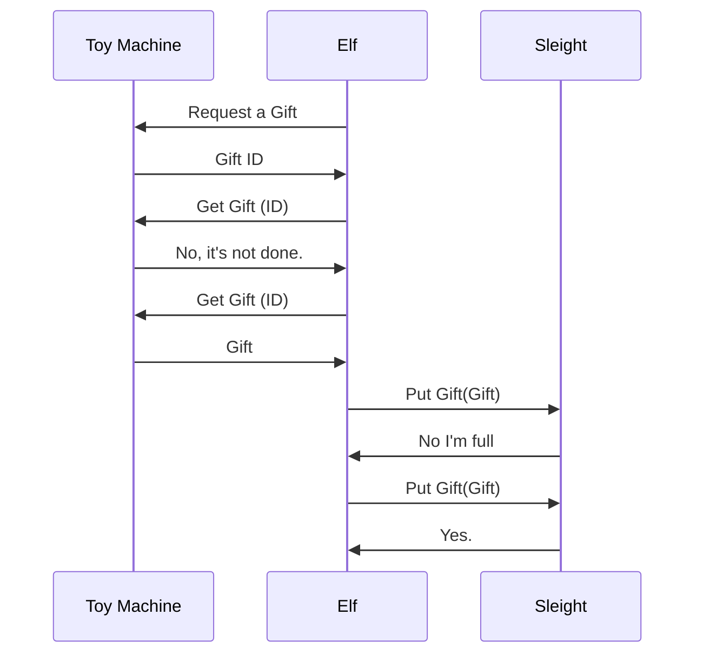

# Christmas Delivery
Implement the Christmas Delivery Kata in golang

Ref: https://codingdojo.org/kata/christmas-delivery/

Add this details :

# Subject aborded

* Docker
* Kubernetes
* Micro-services
* Concurrent programming

# Steps

## One of each

First step build 3 services: one for Sleight, one for Elf and one for the toy machine. They must communicate and deliver a present. 

## Delay

Add delay on each entities : 
* 3 seconds to build a present
* 5 seconds to put it on sleight
* 25 seconds to delivers gifts 

## Multi threads

Put each entity in one thread.
And build a dashboard to show all activities.

## Services

Put each entity in a container exposed in gRPC and / or REST. Deploy it on a kubernetes cluster.

Tutorial : https://kubernetes.io/fr/docs/tutorials/kubernetes-basics/deploy-app/_print/

